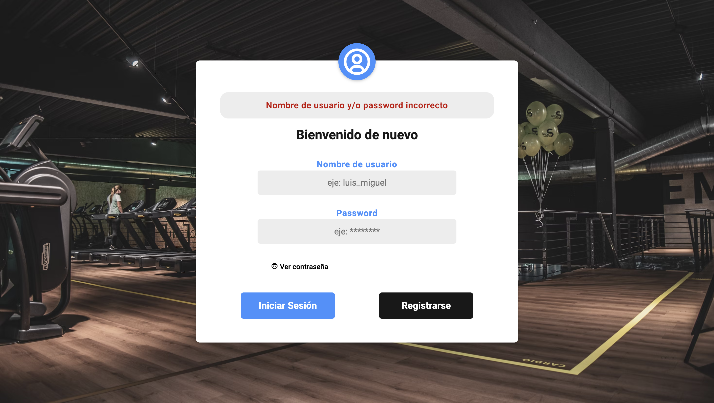

<a name="readme-top"></a>

[![Contributors][contributors-shield]][contributors-url]
[![Forks][forks-shield]][forks-url]
[![Stargazers][stars-shield]][stars-url]
[![Issues][issues-shield]][issues-url]
[![MIT License][license-shield]][license-url]
[![LinkedIn][linkedin-shield]][linkedin-url]


<!-- PROJECT LOGO -->
<br />
<div align="center">
<!--TODO: cambiar esto y ponerle el link a la pagina-->
  <a href="https://github.com/othneildrew/Best-README-Template">
    
  </a>

  <h3 align="center">CoreFury Gym</h3>

  <p align="center">
    Tournament and Registered Participants Module
    <br />
    <br />
    <!--TODO: esto hay que modificarlo para poner el link a la pagina-->
    <a href="https://github.com/othneildrew/Best-README-Template">View Demo</a>
    ·
    <a href="mailto:rmedinamartindelcampo@gmail.com">Richard Medina Email</a>
</div>


<!-- TABLE OF CONTENTS -->
<!--TODO: acomodar esto ya al final-->
<details>
  <summary>Table of Contents</summary>
  <ol>
    <li>
      <a href="#about-the-project">About The Project</a>
      <ul>
        <li><a href="#built-with">Built With</a></li>
      </ul>
    </li>
    <li>
      <a href="#getting-started">Getting Started</a>
      <ul>
        <li><a href="#prerequisites">Prerequisites</a></li>
        <li><a href="#installation">Installation</a></li>
      </ul>
    </li>
    <li><a href="#usage">Usage</a></li>
    <li><a href="#roadmap">Roadmap</a></li>
    <li><a href="#contributing">Contributing</a></li>
    <li><a href="#license">License</a></li>
    <li><a href="#contact">Contact</a></li>
    <li><a href="#acknowledgments">Acknowledgments</a></li>
  </ol>
</details>


<!-- ABOUT THE PROJECT -->
## About The Project


This project focuses on the development of a new platform designed for the efficient management of the university gym. The platform provides gym employees with the ability to access their employee accounts, facilitating their daily tasks. For those employees who are new to the system, the platform offers the option to create an account easily.

In addition to implementing the login system, a module dedicated to "Tournaments and Participants" has been created. This module manages the various tournaments offered by the gym, allowing employees not only to administer tournament information but also to register participants. It goes beyond registration, providing the capability to edit and delete data of the registered participants.

The development of this platform has been carried out using an SQL database **MySql** to store information in a structured manner. The set of technologies used includes **PHP** for server-side logic, **Jquery** to enhance interactivity, and **Bootstrap** styles for a modern and responsive user interface.

This project not only simplifies the daily operations of gym staff but also enhances the overall user experience by providing easy and efficient access to the services offered by the university gym.

<p align="right">(<a href="#readme-top">back to top</a>)</p>

## Project status

This project is currently in active development. Each module that will comprise the application is being developed by various collaborators, and progress is ongoing on different fronts. The content of this repository reflects the specific contribution I have made so far.

While some components may be fully functional, it's important to note that other parts of the project are still in the development process and may undergo significant changes in future updates. Specifically, in my collaboration, the sections for "Account Settings" and "Help" are yet to be developed. These features are located in the dropdown menu accessible by clicking on the profile picture.

Your contributions and feedback are welcome as we work to improve and complete all aspects of the project.

### Tech Stack

In this section, we list the set of technologies (tech stack) that have been used and continue to be employed in this project.

Client: 

* [![JQuery][JQuery.com]][JQuery-url]
* [![JavaScript][JS.com]][JavaScript-url]
* CSS
* HTML
* [![Bootstrap][Bootstrap.com]][Bootstrap-url]

Server: 

* [![PHP][PHP.com]][PHP-url]

DataBase: 

* [![MySQL][MySql.com]][MysQl-url]

Dependency manager: 

* Composer


<p align="right">(<a href="#readme-top">back to top</a>)</p>

### Prerequisites

For this project, it is necessary to have Composer, as we have a couple of dependencies installed with Composer that are essential for the project's functionality.

* Composer
```composer
composer install
composer require vlucas/phpdotenv:^5.6 phpmailer/phpmailer:^6.9
```

Likewise, it is required to have a server such as XAMPP, Wamp, or another that can assist in visualizing the project.```

## External Libraries (CDN)

This project utilizes the following external libraries through CDN. Make sure to include them in your development environment:

**Bootstrap (5.2.3)**

This project leverages Bootstrap styles to craft a dynamic, visually appealing, and responsive user interface.

html Copy code

**links**
```html
<link href="assets/vendor/bootstrap/css/bootstrap.min.css" rel="stylesheet">
<link href="assets/vendor/bootstrap-icons/bootstrap-icons.css" rel="stylesheet">
<link href="assets/vendor/boxicons/css/boxicons.min.css" rel="stylesheet">
<link href="assets/vendor/quill/quill.snow.css" rel="stylesheet">
<link href="assets/vendor/quill/quill.bubble.css" rel="stylesheet">
<link href="assets/vendor/remixicon/remixicon.css" rel="stylesheet">
<link href="assets/vendor/simple-datatables/style.css" rel="stylesheet">
```
**scripts**
```html
<script src="assets/vendor/apexcharts/apexcharts.min.js"></script>
<script src="assets/vendor/bootstrap/js/bootstrap.bundle.min.js"></script>
<script src="assets/vendor/chart.js/chart.umd.js"></script>
<script src="assets/vendor/echarts/echarts.min.js"></script>
<script src="assets/vendor/quill/quill.min.js"></script>
<script src="assets/vendor/simple-datatables/simple-datatables.js"></script>
<script src="assets/vendor/tinymce/tinymce.min.js"></script>
<script src="assets/vendor/php-email-form/validate.js"></script>
```
**jQuery (3.6.4)**

In addition, jQuery was incorporated to enhance the dynamics of the page, providing a more interactive experience. Its implementation ranges from adding components to improving table functionality and implementing features such as search in input fields, among others.

html Copy code

**script**
```html
<script src="https://code.jquery.com/jquery-3.6.4.min.js"></script>
```
**Boxicons**

While leveraging Bootstrap icons, we also utilized icons from Boxicons. Some icons that couldn't be found in Bootstrap Icons were sourced from this excellent website called Boxicons. This choice was not only due to the unavailability in Bootstrap but also because the icons from Boxicons were visually more appealing.

html Copy code

**script**
```html
<script src="https://unpkg.com/boxicons@2.1.4/dist/boxicons.js"></script>
```
<!-- USAGE EXAMPLES -->
## Usage

The project aims to assist university gym employees in carrying out their daily tasks more efficiently.

**Login:**

The employee should log in to the platform using their username and the password they have created.

When logging in to the platform, a tracking of who is connecting, from where (IP), the operating system of the device, and the browser being used will be conducted. This information will be stored in the **'tracking'** table in the database and will be used at the discretion of managers and supervisors.


If the entered password is incorrect, an error message will be displayed.



**SignUp**

Should the employee not have an account on the platform, either because they are new or because their responsibilities within the gym have not necessitated it, they can create an account. The account creation process requires the following details, as shown in the image:


There are two cases in which the user cannot create an account:

* 1. If they already have an active account.
* 2. If they are not a gym employee.

Beyond that, the employee will be able to successfully create their account and access the platform.

**We enter the platform**

When accessing the session, at this moment, we will have access to the views of: 

* **1. Home:** 


At the home view, there is a banner featuring a motivational phrase alongside the gym's name, followed by a slideshow showcasing additional photos.

* **2. Participants:**


In the 'Participants' view, information about individuals registered in one or more tournaments organized by the gym is displayed. Here, several functions are available, including: 

* A - The ability to add new participants (blue button at the top left).
* B - Edit participant information (green button). 
* C - Delete a participant (red button). 
* D - Search for a participant using the search input, either by their name, tournament, or team name.
* E -If you click on the name of the tournament in the table it will send you to a view where it will give you information about the tournament and who is part of it. 

:notebook: If the participant still has an outstanding balance due for payment of the tournament, it will be highlighted in red; once the indebtedness is settled, it will no longer be marked in red."

* **3. Tournament:**


Similar to the 'Participants' view, here in 'Tournaments', we can also visualize information about the tournaments offered by the gym. Additionally, we can perform the following actions: 

* A - Add new tournament (blue button at the top left).
* B - Edit tournament information (green button). 
* C - Delete a tournament (red button). 
* D - Search for a tournament using the search input, either by their name, center, sport name or price.
* E -If you click on the name of the tournament in the table it will send you to a view where it will give you information about the tournament and who is part of it. 

:notebook: If the tournament is already full of participants, it will be marked in red in the table and in the tournament options, in the "add participant" view, this option will no longer appear.

<p align="right">(<a href="#readme-top">back to top</a>)</p>


<!-- ROADMAP -->
## Roadmap

- [x] Login view
- [x] Sign Up view
- [x] Log out
- [x] Platform View
    - [x] Participants
        -[x] Add participant view
        -[x] Update participant buttom
        -[x] Delate participant buttom
    - [x] Tournaments
        - [x] Add tournament view
        - [x] Update tournament buttom
        - [x] Delate tournament buttom
    - [ ] My profile view
    - [ ] Help view

<p align="right">(<a href="#readme-top">back to top</a>)</p>

<!-- LICENSE -->
## License

Project sponsored by `Universidad Enrique Diaz de Leon`

<p align="right">(<a href="#readme-top">back to top</a>)</p>

<!-- CONTACT -->
## Contact

Ricardo Abraham Medina Martin del Campo - [@instagram](https://www.instagram.com/richard_b_stone/?hl=es-la)

My email - [rmedinamartindelcampo[at]gmail[dot]com](mailto:rmedinamartindelcampo@gmail.com)

<!--TODO: cambiar esto cuando el link este listo-->
CoreFury Gym: [https://github.com/your_username/repo_name](https://github.com/your_username/repo_name)

<p align="right">(<a href="#readme-top">back to top</a>)</p>

<!-- ACKNOWLEDGMENTS -->
## Acknowledgments

Use this space to list resources you find helpful and would like to give credit to. I've included a few of my favorites to kick things off!

* [Choose an Open Source License](https://choosealicense.com)
* [GitHub Emoji Cheat Sheet](https://www.webpagefx.com/tools/emoji-cheat-sheet)
* [Malven's Flexbox Cheatsheet](https://flexbox.malven.co/)
* [Malven's Grid Cheatsheet](https://grid.malven.co/)
* [Img Shields](https://shields.io)
* [GitHub Pages](https://pages.github.com)
* [Font Awesome](https://fontawesome.com)
* [React Icons](https://react-icons.github.io/react-icons/search)

<p align="right">(<a href="#readme-top">back to top</a>)</p>


<!-- MARKDOWN LINKS & IMAGES -->
<!-- https://www.markdownguide.org/basic-syntax/#reference-style-links -->
[contributors-shield]: https://img.shields.io/github/contributors/othneildrew/Best-README-Template.svg?style=for-the-badge
[contributors-url]: https://github.com/othneildrew/Best-README-Template/graphs/contributors
[forks-shield]: https://img.shields.io/github/forks/othneildrew/Best-README-Template.svg?style=for-the-badge
[forks-url]: https://github.com/othneildrew/Best-README-Template/network/members
[stars-shield]: https://img.shields.io/github/stars/othneildrew/Best-README-Template.svg?style=for-the-badge
[stars-url]: https://github.com/othneildrew/Best-README-Template/stargazers
[issues-shield]: https://img.shields.io/github/issues/othneildrew/Best-README-Template.svg?style=for-the-badge
[issues-url]: https://github.com/othneildrew/Best-README-Template/issues
[license-shield]: https://img.shields.io/github/license/othneildrew/Best-README-Template.svg?style=for-the-badge
[license-url]: https://github.com/othneildrew/Best-README-Template/blob/master/LICENSE.txt
[linkedin-shield]: https://img.shields.io/badge/-LinkedIn-black.svg?style=for-the-badge&logo=linkedin&colorB=555
[linkedin-url]: https://linkedin.com/in/othneildrew

[product-screenshot]: images/screenshot.png


[Bootstrap.com]: https://img.shields.io/badge/Bootstrap-563D7C?style=for-the-badge&logo=bootstrap&logoColor=white
[Bootstrap-url]: https://getbootstrap.com

[JQuery.com]: https://img.shields.io/badge/jQuery-0769AD?style=for-the-badge&logo=jquery&logoColor=white
[JQuery-url]: https://jquery.com 

[PHP.com]:http://poser.pugx.org/phpunit/phpunit/require/php
[PHP-url]:https://PHP.com

[MySql.com]:https://shields.io/badge/MySQL-lightgrey?logo=mysql&style=plastic&logoColor=white&labelColor=blue
[MysQl-url]:https://MySql.com

[JS.com]:https://shields.io/badge/JavaScript-F7DF1E?logo=JavaScript&logoColor=000&style=flat-square
[JavaScript-url]:https://JS.com